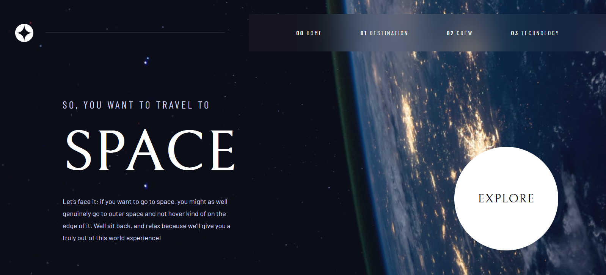

<h1 align="center">Space Tourism</h1>

    
    
    
    
    

This multipage site was built with react, react router and styled-components. This site uses react router to illustrate the concept of Single Page Application. 

The design and the different illustrations come from a figma board provided during the [challenge](https://www.frontendmentor.io/challenges/space-tourism-multipage-website-gRWj1URZ3) proposed by Frontend Mentor. 

